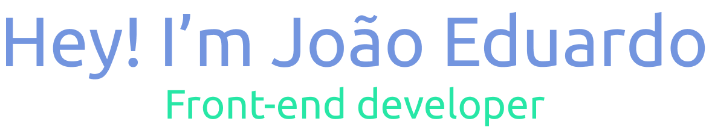
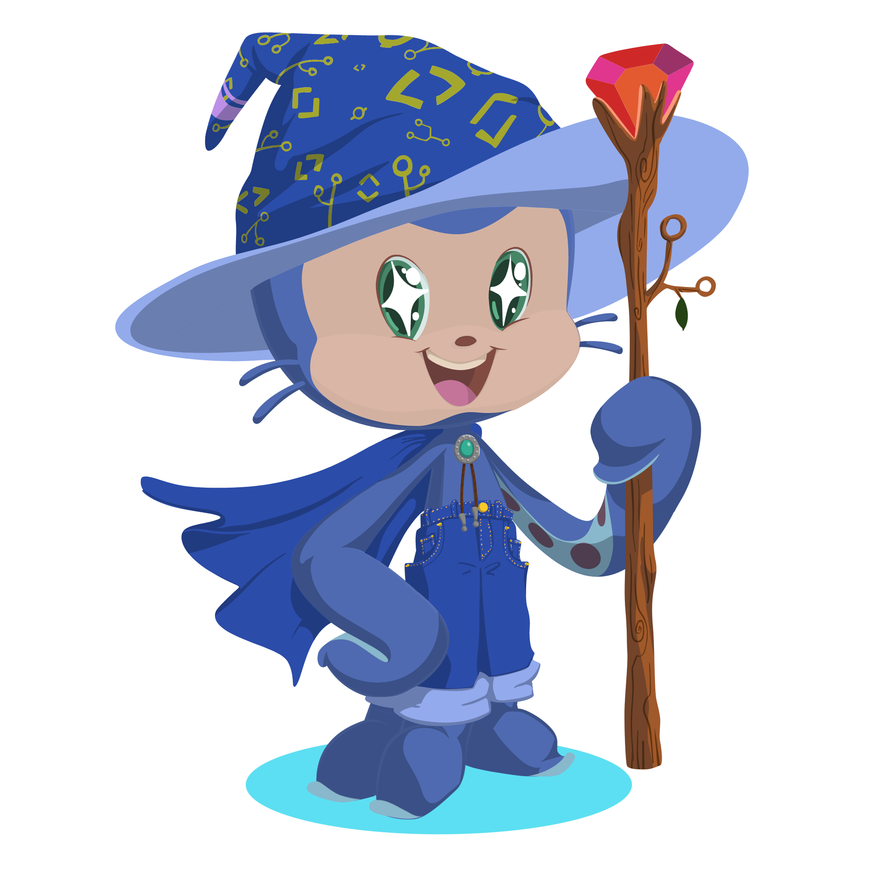

  

  <a href="https://github.com/Joao-Eduardo-AJ">
  
  

 
  
  
  
  
  
  
  ##
 

   
  
  
   
  
  

## Um pouco sobre mim!

Sou um desenvolvedor front-end tranquilo, determinado e constante, muito sociável.
Busco entender as pessoas e o ambiente à minha volta. Possuo inúmeros
hobbies, entre eles, leitura e esportes, priorizo minha evolução pessoal e
gosto de fazer investimentos. Consumo diariamente conteúdos voltados ao desenvolvimento, afim de me tornar um desenvolvedor fullstack
 
 

  
  
##

  <ul> 
    <li>📚 Estudando React </li>
    <li>💼 Procurando estágio na área de desenvolvimento web </li>
    <li>😎 Futuro desenvolvedor fullstack </li>
    <li>🎨 Atualmente focado em linguagens responsáveis pelo front-end </li>
    <li>🔜 Próxima ferramenta que irei estudar: PHP </li>
  </ul>

